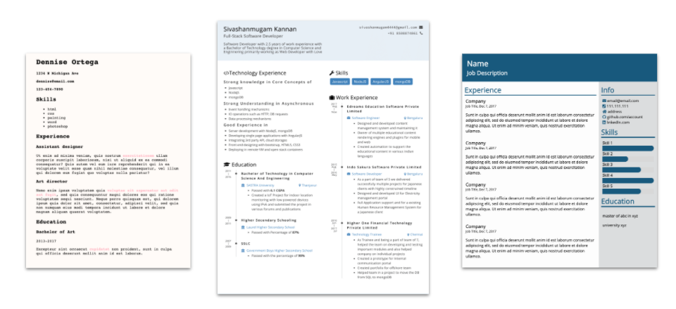
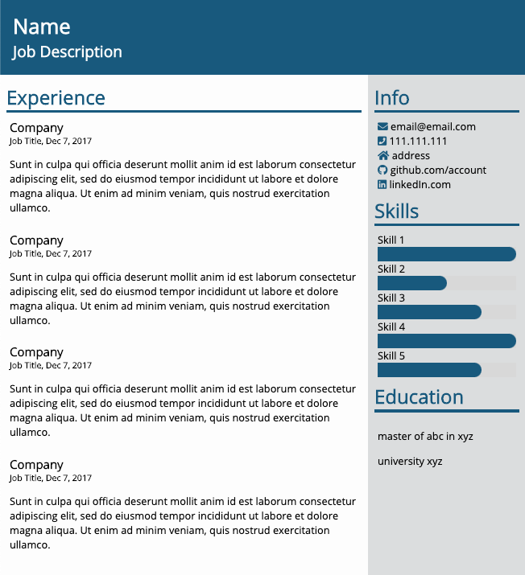
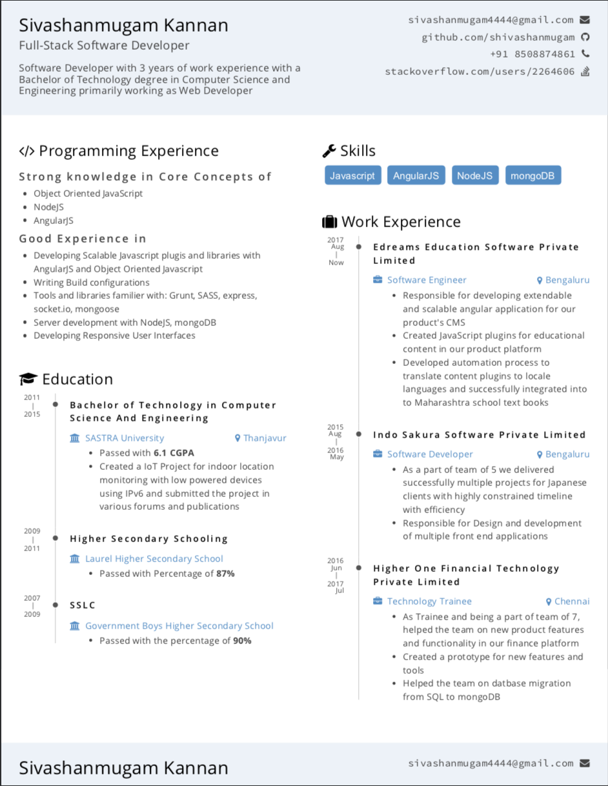

# Your Resume (CV) in HTML and CSS

You are in your way to be a software developer, you are going to need to update your Resume eventually, hug? 💪😅

These are some examples of resumes you can build:

| Version 1 | Version 2 | Version 3 |
| --------- | --------  | --------  |
|   [Click to expand](./version1.png) |   [Click to expand](./version2.png) |   [Click to expand](./version3.png) |

# 📝 Instructions

The ideal example is **version 3** but you can build version 1 or version 2 first, and later jump into version 3.

Start by drawing your strategy!

Look at the expected result and use a marker to identify the tags, imagen what CSS styles will you be applying to them, remember to reuse styles, don't repeat yourself!

## 💡Tips when building your resume:

1. Rely heavily on the different HTML tags available: `<h1>`, `<h2>`, `<h3>`, `
` (paragraph), `<ul>` or `<ol>` (bullets or ordered list), `<divs>`.

2. Start by defining your strategy, pick the tags first. Then start coding.

3. When building your CSS start from the most generic and general to the most specific, it will decrease the amount of work dramatically. For example: 
    - You can apply a style to all of your h1 at once to make them stronger.
    - You can apply the font family to the entire website `<body>`.
    - You can pick the colors for everything and then only specify different colors for the few exceptions.
